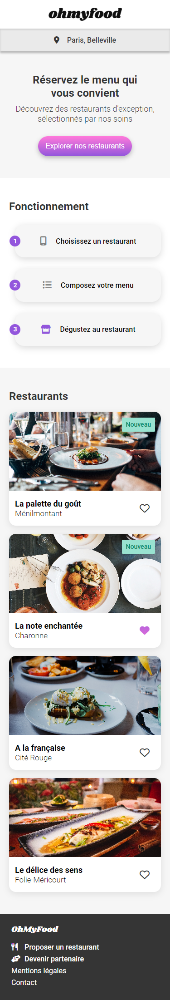

# Openclassrooms - Projet 3 : Dynamisez une page web avec des animations CSS

## Table des matières

-   [Openclassrooms - Projet 3 : Dynamisez une page web avec des animations CSS](#openclassrooms---projet-3--dynamisez-une-page-web-avec-des-animations-css)
    -   [Table des matières](#table-des-matières)
    -   [Aperçu](#aperçu)
        -   [Screenshots](#screenshots)
            -   [Version Mobile](#version-mobile)
            -   [Version Desktop](#version-desktop)
        -   [Liens](#liens)

## Aperçu

### Screenshots

#### Version Mobile

#### Version Desktop

### Liens

-   Code du site : [GitHub](https://github.com/stephanievanoverberghe/ohmyfood)
-   Site en direct : [GitHub Pages](https://stephanievanoverberghe.github.io/ohmyfood/)
