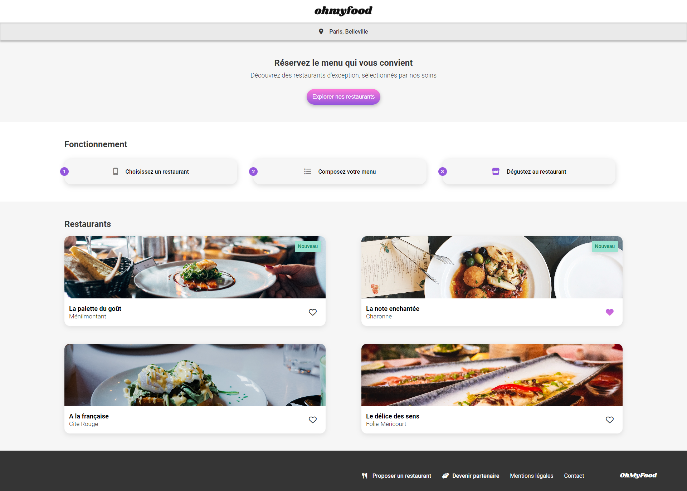

# Openclassrooms - **Projet 3** : Dynamisez une page web avec des animations CSS

## Table des matières

-   [Openclassrooms - **Projet 3** : Dynamisez une page web avec des animations CSS](#openclassrooms---projet-3--dynamisez-une-page-web-avec-des-animations-css)
    -   [Table des matières](#table-des-matières)
    -   [Aperçu](#aperçu)
    -   [Technologies utilisées](#technologies-utilisées)
    -   [Liens](#liens)

## Aperçu

## Technologies utilisées

## Liens

-   Code du site : [GitHub](https://github.com/stephanievanoverberghe/ocr-p3-ohmyfood)
-   Site en direct : [GitHub Pages](https://stephanievanoverberghe.github.io/ocr-p3-ohmyfood/)
